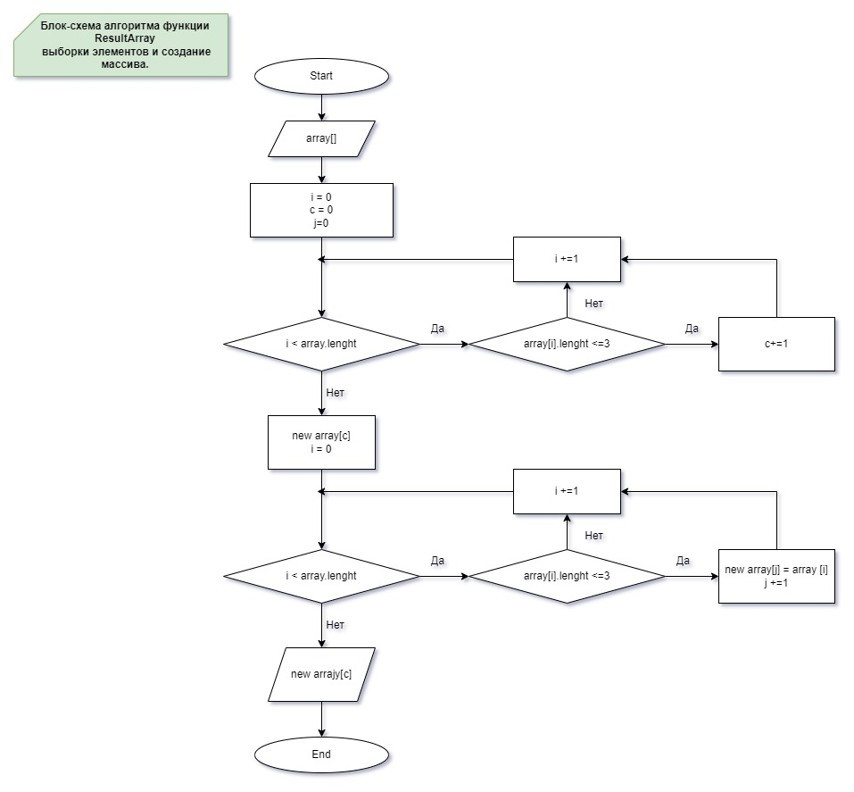

## **Порядок выполнения итоговой работы по основному блоку.**
### **I. Создание репозитория в GitHub.**
На сайте GitHub был создан публичный репозиторий FinalControlWorkMainBlock.
### **II. Создание локальной папки проекта.**
1. На локальном компьютере была создана папка с именем проекта.
2. В программе VSC созданная папка была открыта.
3. В терминале VSC командой <_dotnet new console_> был создан проект на C#.
4. В терминале VSC командой <_git init_> был создан локальный репозиторий проекта.
### **III. Cоздание блок-схемы решения задачи.**
1. Были рассмотрены различные варианты решения задачи и создана блок схема основной функции 

### **III. Написание кода на C#.**
